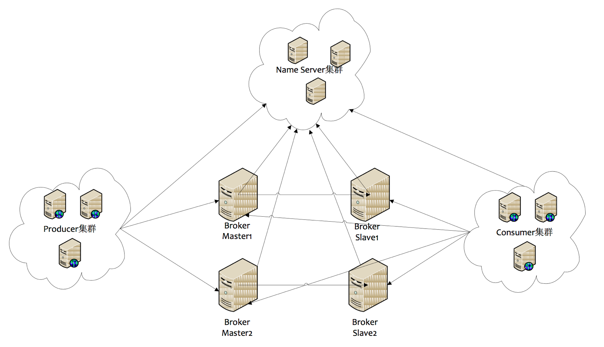

## RocketMQ Demo

### RocketMQ 架构

Name Server:

- 有点类似于Duboo 中Zookeeper的作用，作为注册中心使用

Broker: 

- 消息中转的角色，负责存储消息（实际的存储是调用的store组件完成的），转发消息，一般也成为server，通jms中的provider
- 每个Broker与Name Server集群中的所有节点建立长连接，定时(每隔30s)发送心跳包到（心跳包包含当前broker信息，ip+端口+topic等）Name Server。Name Server定时(每隔10s)扫描所有存活broker的连接，如果Name Server超过2分钟没有收到心跳，则Name Server断开与Broker的连接。

Producer:

- 消息的生产者
- 与Name sever集群中的其中一个节点（随意选择）建立长连接，定期的从Name Server取Topic路由信息，并向提供Topic服务的Master简历长连接，且定时向Master发送心跳。Producer完全无状态，可以集群部署。

Consumer:

- 消息的消费者
- 与Name Server集群中的其中一个节点(随机选择)建立长连接,定期从Name Server取Topic路由信息，并向提供Topic的Master、Slave简历长连接，且定时向Master、Slave发送心跳，Consumer既可以从Master订阅消息，也可以从Slave订阅消息，订阅规则有Broker配置决定。

Producer Group：

- 标识一类Producer（分布式）

Consumer Group：

- 标识一类的Consumer

Topic:

- 主题，消费者根据主题消费消息

Tag:

- 二级主题

### 安装RocketMQ 

官方文档地址：http://rocketmq.apache.org/docs/quick-start/

官方文档有点简洁，以下是我个人的安装过程

下载安装包并解压

~~~
# 1.下载zip文件
wget http://mirror.bit.edu.cn/apache/rocketmq/4.4.0/rocketmq-all-4.4.0-source-release.zip 
# 2.解压
unzip rocketmq-all-4.4.0-source-release.zip
# 3.进入文件夹，执行maven install命令
mvn -Prelease-all -DskipTests clean install -U
~~~

然后创建一个rocketmq_data文件夹，用来保存rockemq启动后的日志以及数据等文件，我这里直接在~下创建

~~~
cd ~
mkdir rocketmq_data
cd rocketmq_data
mkdir logs
mkdir store
cd store
mkdir commitlog
mkdir consumequeue
mkdir index
~~~

文件夹说明：
~~~
logs:存储rocketmq日志
store:存储rocketmq数据文件
commitlog:存储rocketmq消息
consumequeue、index:存储消息的索引数据
~~~

rocketmq-all-4.4.0/distribution/conf目录配置文件说明

~~~
2m-2s-async:2主2从异步，这里异步是消息提供者发送消息给broker主服务器后，服务器立即返回结果，而不需等待服务器将消息写入硬盘后再返回。
2m-2s-sync:2主2从同步，与上面的异步相反
2m-noslave:2主0从
~~~

在conf文件夹下，随便复制一个.properties文件，然后修改里面的配置

~~~
# broker所属集群名字
brokerClusterName=rocketmq-cluster
# broker名字
brokerName=broker-01
# 0表示master, >0 表示slave
brokerId=0
# nameServer地址
namesrvAddr=
# 发送消息时，自动创建服务器不存在的Topic，默认创建的队列数
defaultTopicQueueNums=4
# 是否允许Broker自动创建Topic,建议线下开启，线上关闭
autoCreateTopicEnable=true
# 是否允许Broker自动创建订阅组，建议线下开启，线上关闭
autoCreateSubscriptionGroup=true
# Broker对外服务端口
listenPort=9001
# 删除文件时间点，默认是凌晨四点
deleteWhen=04
# 文件保留时间,默认48小时
fileReservedTime=120
# commitLog每个文件的大小，默认1G
mapedFileSizeCommitLog=1073741824
# ConsumeQueue每个文件默认存30W条，根据业务情况调整
mapedFileSizeConsumeQueue=300000
# 检测物理文件磁盘空间
diskMaxUsedSpaceRatio=88
# 存储路径
storePathRootDir=/root/softwares/rocketmq_data/store
# commitLog存储路径
storePathCommitLog=/root/softwares/rocketmq_data/store/commitlog
# 消费队列存储路径
storePathConsumeQueue=/root/softwares/rocketmq_data/store/consumequeue
# 消息索引存储路径
storePathIndex=/root/softwares/rocketmq_data/store/index
# checkpoint文件存储路径
sotreCheckpoint=/root/softwares/rocketmq_data/store/checkpoint
# abort文件存储路径
abortFile=/root/softwares/rocketmq_data/store/abort
# 限制的消息大小
maxMessageSize=65536
# ASYNC_MASTER 异步复制Master,SYNC_MASTER 同步双写Master
brokerRole=ASYNC_MASTER 
# 刷盘方式,ASYNC_FLUSH 异步刷盘，SYNC_FLUSH同步刷盘
flushDiskType=ASYNC_FLUSH
# 发消息线程池数量
# sendMessageTreadPoolNums=128
# 拉取消息线程池数量
# pullMessageTreadPoolNums=128
# 配置IP
brokerIP1=本机的外网IP
~~~

修改conf目录下所有xml文件，保证日志路径正确，日志路径默认为：~/logs/rocketmqlogs

~~~
# sed -i's#源字符串#新字符串#g' 替换的文件
sed -i 's#{user.home}#/root/softwares/rocketmq_data/logs' *.xml
~~~

RocketMQ默认对内存要求至少4G，我这里使用的是虚拟机，只分配了1G内存，需要修改distribution/target/apache-rocketmq/bin目录下的runbroker.sh和runserver.sh文件才可启动

~~~
# 修改前
JAVA_OPT="${JAVA_OPT} -server -Xms8g -Xmx8g -Xmn4g"

# 修改后
JAVA_OPT="${JAVA_OPT} -server -Xms1g -Xmx1g -Xmn1g"
~~~

先启动nameServer,需要在distribution/target/apache-rocketmq/bin文件夹下执行

~~~
  # 后台执行mqnamesrv，并将执行结果输出到~/logs/nohup/nameser.log文件中
  > nohup sh mqnamesrv > ~/logs/nohup/nameser.log &
  > tail -f ~/logs/rocketmqlogs/namesrv.log
  The Name Server boot success...
~~~

再启动Broker

~~~
  # nohup sh bin/mqbroker -n localhost:9876 &
  # 指定配置文件启动broker
  >nohup sh mqbroker -c /root/softwares/rocketmq_data/rocket_broker.properties > ~/logs/nohup/broker.log &
  > tail -f ~/logs/rocketmqlogs/broker.log 
  The broker[%s, 172.30.30.233:10911] boot success...
~~~

终止服务

~~~
> sh bin/mqshutdown broker
> sh bin/mqshutdown namesrv
~~~

### RocketMQ 控制台

github地址：https://github.com/apache/rocketmq-externals

下载好后，其中有一个名为：rocketmq-console的项目，该项目是一个spring boot项目，修改一下配置文件中的nameservAddr就可执行

